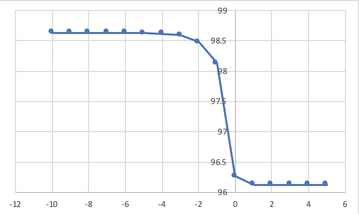

### Report 

 王琛 计65 2016011360 

### 1. Experiment Design

实验的主要原理可以使用等式 (1)概括:

​							$ \hat y = argmax_{y}P(y) \prod_{i=1}^{n}P(x_{i}|y)$          (1)

因此实验目的很清晰，就是计算$P(y)$（垃圾邮件与否的概率）和$P(x_{i}|y)$（在邮件类型是y的情况下词x出现的概率）

我将实验大致分成了三个部分：

- 读取每个邮件的标签，然后随机分成五折. 
- 训练，计算概率
- 一个贝叶斯分类器

一开始我准备实现一个独立于使用场景的NB， 但是 $P(y)$ 和 $P(x_{i}|y)$ 的计算似乎都和使用情景有关，想完全抽象有些困难。因此我实现了两个类 -- `BayesClassifier`, 一个抽象类定义了使用朴素贝叶斯时需要用到的函数的参数以及 `BayesSpamFilter` 实现了`BayesClassifier`中的抽象方法。

实验代码结构如下 (`src`文件夹)：

- `config.py`：定义了实验中需要用到的参数，比如数据的路径，哪里存放训练结果等等。比较重要的是随机种子的设置，实验中有两个地方用到了随机数种子。一个是划分5折时 (`parser.py`), 对应了`config.py`中的`fold_seed`，是一个5个元素的列表，表示issue1中5次随机采样。另外一个地方时选择验证集大小时 (`test.py`)，对应的是`train_seed=17`。
- `parser.py`: 
  - `get_label`: 读取文件 `label/index` 并且返回一个dict { 'email_path' : 'spam or ham' }
  - `divide_into_folds`: 使用 `get_label` 返回的dict然后将每个email划分到5折中的一个，并且将5折的结果保存到`../dataset`中。
- `train.py`:
  - `get_set`: 从5折数据中得到测试集和训练集
  - `train`: 计算训练集中spam和ham邮件的个数，计算每个词在spam和ham出现的次数，用于后面计算概率使用。参数 `train_per` 表示使用训练集的比例。
- `spamfilter.py`:
  - `class BayesClassifier`: 定义了 `cal_py`, `cal_p_xi_y`, `classify`的抽象类
  - `class BayesSpamFilter`: 
    - `cal_py`: 计算spam和ham邮件的概率
    - `cal_p_xi_y`: 计算等式(1)中的 $P(x_{i}|y)$ ，也就是当`y`是spam或者ham时词 $x_{i}$ 出现的概率
    - `split_email`: 提取中邮件的中文部分
- `test.py`：
  - `change_trainset`: 完成了issue1的要求，3种训练集下执行五次五折交叉验证
  - `change_lambda`: 完成了issue2的要求，改变$\alpha$看各个metric的变化
  - `add_features`：完成了issue3的要求，可以选择是否使用发件人邮箱和Mailer信息

### 2. Issue Addressing

#### Issue 1: The size of training set

划分五折数据时，五次采用的随机数种子分别是`fold_seed=[1999, 538, 2297, 154, 958]`。然后在`train.py/train`中使用参数`train_per`定义使用训练集的大小。结果如下 (这里使用了laplace平滑，且$\lambda=1$，并且没有使用Issue 3中的新feature)：

|  种子   |   5%    |   50%   |  100%   |
| :-----: | :-----: | :-----: | :-----: |
|  1999   | 95.1192 | 96.1514 | 96.2628 |
|   538   | 95.1464 | 96.1342 | 96.2704 |
|  2297   | 95.1769 | 96.1479 | 96.2793 |
|   154   | 95.4325 | 96.0973 | 96.2487 |
|   958   | 94.9817 | 96.0467 | 96.2539 |
|   Min   | 94.9817 | 96.0467 | 96.2487 |
|   Max   | 95.4325 | 96.1514 | 96.2793 |
| Average | 95.1695 | 96.1155 | 96.2630 |

从上表可以得出以下结论：

- 采用不同的随机数种子所得到的最终准确率结果基本没有差别。事实上，五折交叉验证时，每一折结果也没有差别，这里不再列出具体数值。这说明模型适用性较好。
- 当训练集大小逐渐变大时，所有情况下都是准确率逐渐上升。但其实上升并不明显，从5%到50%上升了1个百分点，而从50%到100%只上升了0.2个百分点。原因训练样本已经足够大了，而且准确率本身已经很高了，提升空间有限。

另外，我对Precision、Recall和F1也进行了计算，这里只列出五次的平均值：

|           |   5%    |   50%   |  100%   |
| :-------: | :-----: | :-----: | :-----: |
| Precision | 96.9331 | 97.2725 | 97.4091 |
|  Recall   | 95.7471 | 96.8591 | 96.9439 |
|    F1     | 96.3364 | 97.0654 | 97.1760 |

综合比较可以发现：

- 每个指标从5%到50%上升比较明显，而50%到100%变化不大

- 各个指标大小关系满足Precision > F1 > Recall > Accuracy

- precision > recall说明对负样本的区分能力大于正样本的识别能力。说明出错原因很可能是将正样本预测成了负样本，即将spam预测成ham。

#### Issue 2: Zero probabilities

实验中，从数据集中不难看出，spam和ham邮件的词表有一部分是不重叠的，计算这些单词概率时便会出现零概率的情况。当然也有可能有的单词训练集中根本没有，这也会导致零概率。

比较常用的smoothing方法是Laplace，即当$x_{i}=k, y=c$没有同时出现时，使用下面等式：
$$
\hat{P}\left(x_{i}=k | y=c\right)=\frac{\#\left\{y=c, x_{i}=k\right\}+\alpha}{\#\{y=c\}+M \alpha}
$$
思想就是将$x_{i}=k, y=c$的出现次数强行加上$\alpha$。与此同时，其他每个单词出现次数都要加上$\alpha$，因此M表示总频数。改变$\alpha$的取值，得到的结果如下：（fold_seed=1999, 且使用全部训练集）

| $\alpha$ | Accuracy | Precision | Recall  | F1 Score |
| :------: | :------: | :-------: | :-----: | :------: |
|  1e-100  | 98.6351  |  98.9804  | 98.9613 | 98.9707  |
|  1e-50   | 98.6227  |  98.9390  | 98.9846 | 98.9617  |
|  1e-10   | 98.1305  |  98.4123  | 98.7746 | 98.5929  |
|    1     | 96.2628  |  97.4075  | 96.9454 | 97.1751  |
|   1e10   | 96.1266  |  97.3133  | 96.8333 | 97.0724  |
|   1e50   | 96.1266  |  97.3133  | 96.8333 | 97.0724  |
|  1e100   | 96.1251  |  97.3132  | 96.8310 | 97.0712  |

画出accuracy和$\alpha$的关系图，可以看出在1附近有比较大的变化。

实际运行是[1e-100, 1e100]每1e10取一个点，表中只列出了其中的几个点，中间有很多点结果变化不明显。从表中可以得出如下结论：

- $\alpha$的取值对于结果又比较大的影响，无论是acc还是f1等metric，可以相差几个百分点。换了一个$\alpha$，一下就将issue1中的结果提升了两个百分点。
- $\alpha$越小结果越好，但是有一定限度，实验中从1e-50到1e-100结果基本没变化。对应的，1e50到1e100也没有变化。
- $\alpha$对Accuracy和Recall的影响明显比另外两个要大，说明$\alpha$对于正样本的识别能力有较大影响，即对于spam能够辨识出来的能力。说明有些词可能spam没有，通过修改权重可以对最后的概率有影响。

#### Issue 3: Specific features

前面的讨论都是指用了邮件中的中文分词信息，对于邮件头中的有用信息并没有使用。我才用了两种可能会影响准确率的信息：

- 发件人使用的Mailer，种类有Foxmail, Microsoft Express等等，垃圾邮件很多是群发的，因此使用的Mailer应当有助于判定
- 发件人的邮件域名，比如edu.cn发出的是垃圾邮件可能性就比较下

下表中列出了单独使用和一起使用这两种特征时带来的结果变化：($\alpha=$ 1e-50, fold_seed=1999)

|    Feature    | Accuracy | Precision | Recall  | F1 Score |
| :-----------: | :------: | :-------: | :-----: | :------: |
|    Mailer     | 98.9802  |  99.1269  | 99.3370 | 99.2318  |
|     From      | 98.9383  |  99.3126  | 99.0851 | 99.1987  |
| Mailer & From | 99.2386  |  99.3800  | 99.4275 | 99.4262  |
|   Baseline    | 98.6227  |  98.9390  | 98.9846 | 98.9617  |

可以看出：

- 单独使用Mailer和From特征都能将98.6%的准确率提升到99%左右，这对于本身就很高的准确率算是很大的提升了。一起使用更是能提升到99.2%。
- 单独使用Mailer和From时，Mailer对于Recall的提升较好，而From对于Precision的提升较好。说明Mailer能够有助于spam的识别，很多垃圾邮件都使用了一种邮箱。而From能够区分负样本，比如edu.cn和cernet.com就很大概率是ham。
- 另外，可以对Mailer和From的特征加大权重，计算概率的时候乘10，可以进一步提高准确率，说明这两种特征是很有用的。

#### 3. 实验总结

这次实验实现了一个朴素贝叶斯分类器，总体上还是比较简单的，最终实现了99.2的准确率和99.4的F1 Score。可以做如下总结：

- 训练集对结果的大小有一定影响，但是50%已经接近够用
- 使用了不同的评价参数，可以帮助我们更好的评判实验结果
- 零概率问题$\alpha$对结果影响很大
- 使用不同的特征能够提高正确率

综上，这次实验虽然不难，但是学到的东西还是很多的。